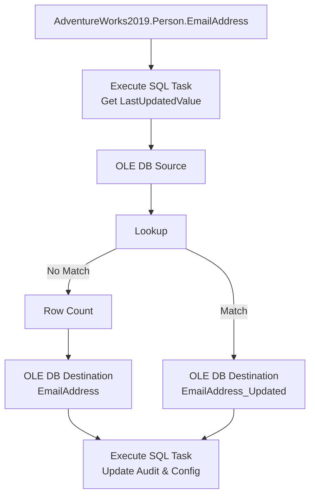
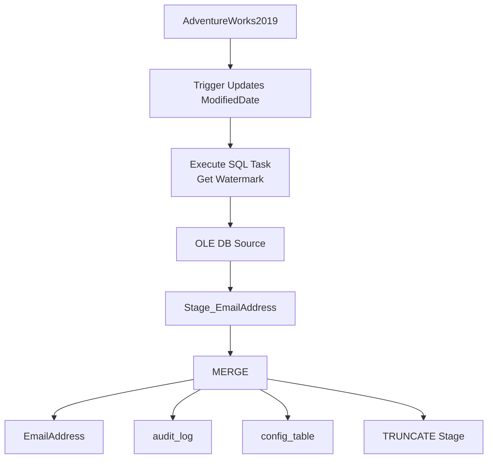

---

# Enterprise Incremental ETL Project

## Source
**Database:** AdventureWorks2019
**Table:** Person.EmailAddress

| BusinessEntityID | EmailAddressID | EmailAddress                                                    | ModifiedDate |
| ---------------- | -------------- | --------------------------------------------------------------- | ------------ |
| 1                | 1              | [ken@adventure-works.com](mailto:ken@adventure-works.com)       | 2024-01-01   |
| 2                | 2              | [terri@adventure-works.com](mailto:terri@adventure-works.com)   | 2024-01-01   |
| 3                | 3              | [robert@adventure-works.com](mailto:robert@adventure-works.com) | 2024-01-01   |

---

# Destination

Database

```
DataWarehouse
```

Table

```
dbo.EmailAddress
```

---

# VERSION 1 (Lookup Based Incremental Load)

This is the approach mostly used in SSIS interview demonstrations and small/medium projects.

---

# Architecture



---

# STEP 1

## Create audit_log

```sql
CREATE TABLE audit_log
(
Id INT IDENTITY,
PackageName VARCHAR(200),
TableName VARCHAR(100),
RecordsInserted INT,
RecordsUpdated INT,
StartTime DATETIME,
EndTime DATETIME,
Status VARCHAR(20),
ErrorMessage VARCHAR(1000)
)
```

---

# STEP 2

## Create config_table

```sql
CREATE TABLE config_table
(
Id INT IDENTITY,
TableName VARCHAR(100),
LastUpdatedColumn VARCHAR(100),
LastUpdatedValue DATETIME
)

INSERT INTO config_table

VALUES

(
'EmailAddress',
'ModifiedDate',
'1900-01-01'
)
```

---

# STEP 3

## SSIS Variables

| Variable         | Datatype | Scope   |
| ---------------- | -------- | ------- |
| LastUpdatedValue | DateTime | Package |
| RecordsInserted  | Int32    | Package |
| PackageName      | String   | Package |
| TableName        | String   | Package |

---

# STEP 4

## Execute SQL Task

Purpose: Read LastUpdatedValue

SQL

```sql
SELECT LastUpdatedValue
FROM config_table
WHERE TableName='EmailAddress'
```

---

Properties

```
ConnectionType = OLE DB
SQLSourceType = Direct Input
ResultSet = Single Row
```

---

Result Set

| Result Name | Variable               |
| ----------- | ---------------------- |
| 0           | User::LastUpdatedValue |

---

# STEP 5

## OLE DB Source

Connection: AdventureWorks2019

SQL

```sql
SELECT
  BusinessEntityID,
  EmailAddressID,
  EmailAddress,
  rowguid,
  ModifiedDate
FROM Person.EmailAddress
WHERE ModifiedDate>?
```

---

Parameter Mapping

| Variable               | Parameter |
| ---------------------- | --------- |
| User::LastUpdatedValue | 0         |

---

# STEP 6

## Lookup

Connection: DataWarehouse

SQL

```sql
SELECT BusinessEntityID
FROM EmailAddress
```

---

General

```
Full Cache

OLE DB Connection

Redirect No Match Output
```

---

Columns

```
Source.BusinessEntityID = Destination.BusinessEntityID
```

---

Output

```
Lookup

Match

No Match
```

---

# STEP 7

## No Match

```
New Record
↓
Row Count
↓
EmailAddress_Insert
```

---

Row Count Variable

```
User::RecordsInserted
```

---

Destination

```
EmailAddress
```

---

Fast Load

```
Rows Per Batch: 10000
Maximum Commit Size: 10000
```

---

# STEP 8

## Match

```
Existing Record
↓
EmailAddress_Updated
```

---

EmailAddress_Updated

Temporary Update Table

---

# STEP 9

## Execute SQL Task

Update Destination

```sql
UPDATE D
  SET 
  D.EmailAddress=S.EmailAddress,
  D.ModifiedDate=S.ModifiedDate
FROM EmailAddress D
INNER JOIN EmailAddress_Updated S
ON D.BusinessEntityID=S.BusinessEntityID
```

---

Audit

```sql
INSERT INTO audit_log VALUES
('IncrementalLoad.dtsx', 'EmailAddress', ?, @UpdatedRecords, GETDATE(), GETDATE(), 'Success', NULL)
```

---

Config

```sql
UPDATE config_table
SET LastUpdatedValue= (SELECT MAX(ModifiedDate) FROM EmailAddress )
WHERE TableName='EmailAddress'
```

---

# First Run

```
Source: 19972
↓
Lookup: No Match
↓
Inserted: 19972
Updated: 0
```

---

# Second Run

User updates

```
EmailAddress

ModifiedDate
```

```
Lookup
↓
Match
↓
EmailAddress_Updated
↓
UPDATE
↓
audit_log
Updated=10
```

---

# Advantages
✅ Easy
✅ Interview friendly
✅ Simple debugging

---

# Disadvantages
❌ Extra Lookup
❌ Extra Update Table
❌ More SSIS components

---

# VERSION 2 (Enterprise MERGE)

This is the approach used in enterprise Data Warehouse projects.

---

# Architecture



---

# STEP 1

Trigger

```sql
CREATE TRIGGER TR_EmailAddress_ModifiedDate
ON Person.EmailAddress
AFTER UPDATE
AS
BEGIN
  SET NOCOUNT ON;
  
  UPDATE A
  SET ModifiedDate=GETDATE()
  FROM Person.EmailAddress A
  INNER JOIN inserted I
  ON A.EmailAddressID = I.EmailAddressID;
END
```

---

# STEP 2

Stage Table

```sql
CREATE TABLE Stage_EmailAddress
(
BusinessEntityID INT,
EmailAddressID INT,
EmailAddress NVARCHAR(50),
rowguid UNIQUEIDENTIFIER,
ModifiedDate DATETIME
)
```

---

# STEP 3

Execute SQL Task

```
Get LastUpdatedValue
```

Same as Version 1.

---

# STEP 4

OLE DB Source

```sql
SELECT *
FROM Person.EmailAddress
WHERE ModifiedDate>?
```

---

Destination

```
Stage_EmailAddress
```

---

# STEP 5

MERGE

```sql
MERGE EmailAddress T
USING Stage_EmailAddress S
ON T.BusinessEntityID=S.BusinessEntityID
WHEN MATCHED AND
    (T.EmailAddress<>S.EmailAddress OR T.ModifiedDate<>S.ModifiedDate)
THEN
    UPDATE SET
    T.EmailAddress=S.EmailAddress,
    T.ModifiedDate=S.ModifiedDate

WHEN NOT MATCHED THEN 
INSERT (BusinessEntityID, EmailAddressID, EmailAddress, rowguid, ModifiedDate)
VALUES (S.BusinessEntityID, S.EmailAddressID, S.EmailAddress, S.rowguid, S.ModifiedDate );
```

---

# STEP 6

Audit

```
MERGE OUTPUT
↓
Inserted Count
Updated Count
↓
audit_log
```

---

# STEP 7

Config

```
Update LastUpdatedValue
↓
MAX(ModifiedDate)
```

---

# STEP 8

```
TRUNCATE Stage_EmailAddress
```

---

# First Run

```
Source: 19972
↓
Stage: 19972
↓
MERGE
Inserted: 19972
Updated: 0
```

---

# Second Run

User updates

```
EmailAddress
↓
Trigger
↓
ModifiedDate updated
↓
Source Query
↓
Stage
↓
MERGE
↓
Updated=10
```

---

# Comparison

| Feature          | Lookup          | MERGE          |
| ---------------- | --------------- | -------------- |
| Insert           | ✅               | ✅              |
| Update           | ✅               | ✅              |
| Delete           | Extra Logic     | Easy           |
| Performance      | Good            | Excellent      |
| Lookup Needed    | Yes             | No             |
| Stage Table      | Optional        | Yes            |
| Maintainability  | Medium          | Excellent      |
| Enterprise Usage | Medium Projects | Large Projects |
| Recommended      | ⭐⭐⭐⭐            | ⭐⭐⭐⭐⭐          |

---

# Which One Should You Explain in an Interview?

### If interviewer asks SSIS components

Explain **Version 1 (Lookup)** because it demonstrates:

* Execute SQL Task
* OLE DB Source
* Lookup
* Row Count
* OLE DB Destination
* Execute SQL Task

### If interviewer asks real-time architecture

Explain **Version 2 (MERGE + Stage + Trigger)** because it is the enterprise-standard approach:

* Simpler package
* Better performance
* Easier maintenance
* Better audit framework
* Scalable for millions of records
* Preferred for production data warehouse implementations.
